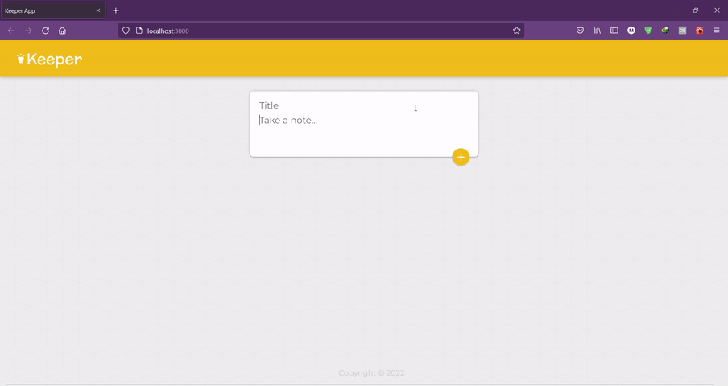

# keeper-App
##the better to do list
## Instructions
- download the files in the folder  
- open new cli tab and make sure you're in the same folder of the project (use pwd to know the directory you're in)
- type "npm i" and let it install packages
- type npm start
## Demo

